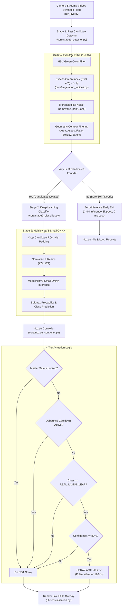

# 🌱 AI Nozzle: Real-Time Precision Pesticide Spraying System

[](https://www.python.org/downloads/)
[](https://opencv.org/)
[](https://onnxruntime.ai/)
[](https://pytorch.org/)
[](LICENSE)

An intelligent, edge-optimized computer vision pesticide spraying system designed for **precision agriculture**. The system performs real-time plant candidate detection and deep-learning anti-spoofing to selectively actuate solenoid spray valves exclusively over **real, living leaves**—eliminating chemical runoff, protecting soil microbiomes, and reducing pesticide waste by up to 80%.

---

## 📌 Table of Contents
- [The Problem vs. Our Solution](#-the-problem-vs-our-solution)
- [Key Features](#-key-features)
- [System Architecture](#-system-architecture)
- [Pipeline Breakdown](#-pipeline-breakdown)
- [Project Directory Structure](#-project-directory-structure)
- [Installation & Setup](#-installation--setup)
- [Quick Start & Usage](#-quick-start--usage)
  - [1. Synthetic Simulation Feed (No Hardware Needed)](#1-synthetic-simulation-feed-no-hardware-needed)
  - [2. Live Camera Stream](#2-live-camera-stream)
  - [3. Pre-Recorded Video](#3-pre-recorded-video)
  - [4. Performance Benchmarking](#4-performance-benchmarking)
- [Interactive Keyboard Controls](#-interactive-keyboard-controls)
- [Dataset Collection & Training](#-dataset-collection--training)
- [Hardware Integration Guide](#-hardware-integration-guide)
- [Configuration Reference](#-configuration-reference)
- [Running Automated Tests](#-running-automated-tests)
- [License](#-license)

---

## 🚜 The Problem vs. Our Solution

| Traditional Broadcast Spraying | AI Nozzle Precision Spraying |
| :--- | :--- |
| ❌ Sprays continuously over crops, weeds, bare soil, and rocks | ✅ Sprays **only** when living target leaves are beneath the nozzle |
| ❌ High chemical costs and heavy pesticide runoff into groundwater | ✅ Drastic reduction in chemical volume (saves up to 60–80% pesticide) |
| ❌ Prone to soil toxicity and crop damage | ✅ Protects soil health and surrounding biodiversity |
| ❌ Simple color sensors get tricked by green paper, cloth, or trash | ✅ **Two-Stage Anti-Spoofing** distinguishes real leaves from artificial fakes |

---

## ✨ Key Features

- **High-Speed Two-Stage Vision Pipeline**:
  - **Stage 1 (Pre-Filter)**: Classical OpenCV color filtering (HSV + Excess Green Index $ExG$) and morphological contour constraints running in **$< 3\text{ ms}$**.
  - **Stage 2 (Verification)**: MobileNetV3-Small classifier accelerated with **ONNX Runtime** on edge CPU.
- **Zero-Inference Early Exit**:
  - Automatically bypasses deep learning inference when frames contain only bare soil, debris, or paths—saving significant CPU/GPU compute and battery on mobile farm robots.
- **Real vs. Fake Leaf Anti-Spoofing**:
  - Differentiates living chlorophyll-rich leaves from printed paper leaves, screen projections, green cloth/t-shirts, and artificial plastic plants.
- **Multi-Tier Valve Safety & Debounce**:
  - Valve debounce lockouts ($250\text{ ms}$) prevent solenoid valve chatter and mechanical wear.
  - Master safety lockout switch arms or disarms physical spraying instantly.
- **Multi-Zone Spatial Boom Targeting**:
  - Maps detected leaf centroid coordinates to Left, Center, or Right spray nozzles.
- **Real-Time Heads-Up Display (HUD)**:
  - Live visual telemetry showing FPS, sub-millisecond latencies, nozzle status badges, and an integrated Picture-in-Picture (PiP) vegetation mask.
- **Built-in Synthetic Scene Generator**:
  - Fully testable out-of-the-box with procedural generation of living leaves, veins, soil textures, and printed substrates.

---

## 🏗 System Architecture



---

## 🔬 Pipeline Breakdown

### Stage 1: Fast Candidate Detection (`core/stage1_detector.py`)
1. **HSV Color Filtering**: Converts BGR frames to HSV and bounds green spectrum hues ($H \in [25, 88]$).
2. **Excess Green Index ($ExG$)**:
   $$\text{ExG} = 2g - r - b \quad \text{where } r, g, b \text{ are normalized color planes}$$
   Highlights chlorophyll reflection and suppresses earthy soil, stone, and dead straw textures.
3. **Morphology**: Elliptical kernel opening removes single-pixel salt-and-pepper noise; closing seals natural leaf venation gaps.
4. **Geometric Filtering**: Rejects contours failing realistic plant bounds (area, aspect ratio, solidity, and extent).

### Stage 2: ROI Classification (`core/stage2_classifier.py`)
- Candidate patches are cropped with an $8\%$ contextual safety margin.
- Fed into **MobileNetV3-Small** quantized/optimized in ONNX.
- Outputs probabilities for:
  - `Class 0: REAL_LIVING_LEAF`
  - `Class 1: FAKE_PRINTED_ARTIFICIAL`

### Actuation Controller (`core/nozzle_controller.py`)
- **Safety Gate**: Verifies master safety lockout switch.
- **Debounce Timer**: Enforces valve cooldown ($250\text{ ms}$) between spray events to prevent valve chatter.
- **Confidence Gate**: Only fires if confidence exceeds threshold ($80\%$).
- **Multi-Zone Indexing**: Splits frame into 3 boom zones (Left, Center, Right) for targeted nozzle triggering.

---

## 📂 Project Directory Structure

```text
Leaf/
├── config/
│   └── settings.yaml            # Master configuration parameters
├── core/
│   ├── __init__.py
│   ├── nozzle_controller.py     # Solenoid valve control & debounce logic
│   ├── pipeline.py              # End-to-end vision & actuation pipeline
│   ├── stage1_detector.py       # Fast OpenCV candidate detector (< 3 ms)
│   ├── stage2_classifier.py     # MobileNetV3-Small ONNX classifier
│   └── vegetation_indices.py    # Vectorized ExG & NGRDI calculations
├── data/
│   ├── collected/               # Data collected via dataset_collector.py
│   │   ├── fake/                # Artificial / printed samples
│   │   └── real/                # Real living leaf samples
│   └── synthetic/               # Procedurally generated training data
├── models/
│   ├── export_onnx.py           # PyTorch to ONNX exporter with dynamic batching
│   ├── mobilenet_v3_small.onnx  # Pre-compiled ONNX edge model
│   └── train.py                 # Training pipeline with moiré/print augmentations
├── tests/
│   ├── test_nozzle.py           # Unit tests for valve & debounce logic
│   ├── test_pipeline_e2e.py     # End-to-end integration tests
│   ├── test_stage1.py           # Unit tests for candidate detector
│   └── test_stage2.py           # Unit tests for ONNX classifier
├── utils/
│   ├── __init__.py
│   ├── synthetic_generator.py   # Procedural farm scene generator
│   └── visualization.py         # HUD overlay & telemetry drawing
├── dataset_collector.py         # One-key interactive dataset labeling tool
├── requirements.txt             # Project dependencies
├── run_live.py                  # Main live application entrypoint
└── README.md
```

---

## 💻 Installation & Setup

### 1. Clone the Repository
```bash
git clone https://github.com/your-username/Leaf.git
cd Leaf
```

### 2. Create and Activate a Virtual Environment
```bash
# Windows
python -m venv .venv
.venv\Scripts\activate

# Linux / macOS
python3 -m venv .venv
source .venv/bin/activate
```

### 3. Install Dependencies
```bash
pip install --upgrade pip
pip install -r requirements.txt
```

---

## 🚀 Quick Start & Usage

### 1. Synthetic Simulation Feed (No Hardware Needed)
Test the entire vision pipeline, early-exit detection, and nozzle simulation immediately:
```bash
python run_live.py --synthetic
```

### 2. Live Camera Stream
Attach a USB webcam or CSI camera on an edge device (e.g. Raspberry Pi):
```bash
python run_live.py --camera 0
```

### 3. Pre-Recorded Video
Run analysis on field footage:
```bash
python run_live.py --video path/to/field_video.mp4
```
*Optional: Save output video with telemetry HUD overlay:*
```bash
python run_live.py --video path/to/field_video.mp4 --save-video output_with_hud.mp4
```

### 4. Performance Benchmarking
Run a headless benchmark (150 frames) to measure exact edge execution latency and FPS:
```bash
python run_live.py --synthetic --benchmark --frames 150
```

---

## ⌨️ Interactive Keyboard Controls

When the live video window is active:

| Key | Action |
| :---: | :--- |
| `q` | **Exit** application cleanly |
| `m` | **Toggle PiP Mask**: Show/hide the raw Stage 1 ExG vegetation mask |
| `s` | **Toggle Master Safety Lockout**: Instantly arm/disarm spray actuation |
| `space` | **Pause / Resume** video stream |
| `c` | **Capture Snapshot**: Save current frame with HUD overlay to disk |

---

## 📊 Dataset Collection & Training

### Collecting Custom Field Samples
Use the interactive one-key labeling tool:
```bash
python dataset_collector.py --camera 0
```
- Aim the camera at a candidate leaf.
- Press **`r`** to save the cropped ROI into `data/collected/real/`.
- Press **`f`** to save fake/printed distractor ROIs into `data/collected/fake/`.

### Training the MobileNetV3-Small Model
Train with specialized augmentations (halftone raster simulation, moiré lines, specular glare, dot-gain blur):
```bash
# Train on synthetic data bootstrapped automatically
python models/train.py --generate-synthetic --epochs 10 --batch-size 16

# Or train on your collected field data
python models/train.py --data-dir data/collected --epochs 15
```

The training script automatically exports the best model checkpoint to `models/mobilenet_v3_small.onnx`.

---

## 🔌 Hardware Integration Guide

### Arduino / ESP32 Relay Driver (Serial Mode)
Set `mode: "serial"` and configure `serial_port: "COM3"` (or `/dev/ttyUSB0` on Linux) in `config/settings.yaml`.

#### Microcontroller Protocol:
When a spray is triggered, the controller writes:
```text
VALVE:<nozzle_index>:ON\n
```
And upon pulse completion ($120\text{ ms}$ later):
```text
VALVE:<nozzle_index>:OFF\n
```

#### Example Arduino Sketch:
```cpp
const int VALVE_PINS[3] = {7, 8, 9}; // Left, Center, Right relay pins

void setup() {
  Serial.begin(115200);
  for (int i = 0; i < 3; i++) {
    pinMode(VALVE_PINS[i], OUTPUT);
    digitalWrite(VALVE_PINS[i], LOW);
  }
}

void loop() {
  if (Serial.available()) {
    String line = Serial.readStringUntil('\n');
    if (line.startsWith("VALVE:")) {
      int firstColon = line.indexOf(':');
      int secondColon = line.indexOf(':', firstColon + 1);
      int nozzleIdx = line.substring(firstColon + 1, secondColon).toInt();
      String state = line.substring(secondColon + 1);
      state.trim();
      
      if (nozzleIdx >= 0 && nozzleIdx < 3) {
        digitalWrite(VALVE_PINS[nozzleIdx], (state == "ON") ? HIGH : LOW);
      }
    }
  }
}
```

---

## ⚙️ Configuration Reference (`config/settings.yaml`)

```yaml
system:
  processing_resolution:
    width: 640
    height: 480

stage1_candidate_detector:
  hsv:
    hue_min: 25               # Greenish-yellow cutoff
    hue_max: 88               # Deep green cutoff
    sat_min: 35
  vegetation_index:
    enabled: true
    method: "exg"             # Excess Green Index (2g - r - b)
    exg_threshold: 0.05
  contour_filters:
    min_area: 450             # Rejects tiny weed noise
    max_area: 180000
    min_solidity: 0.40        # Rejects jagged non-leaf clutter

stage2_classifier:
  model_path: "models/mobilenet_v3_small.onnx"
  input_size: 224
  confidence_threshold: 0.80  # Minimum probability required to trigger spray

nozzle_controller:
  mode: "simulation"          # "simulation" or "serial"
  spray_pulse_ms: 120         # Valve open duration
  cooldown_ms: 250            # Debounce lockout period
  serial_port: "COM3"
  baud_rate: 115200
  safety_lockout: false
```

---

## 🧪 Running Automated Tests

Verify pipeline logic, debounce timing, and detection accuracy with the built-in test suite:
```bash
python -m unittest discover -s tests -v
```

Tests include:
- `test_pipeline_on_empty_soil`: Validates zero-inference early exit ($0\text{ ms}$ Stage 2 latency).
- `test_spray_on_high_confidence_real_leaf`: Validates spray actuation on real leaves.
- `test_reject_fake_printed_leaf`: Validates anti-spoofing rejection of printed leaves.
- `test_cooldown_debounce_lockout`: Validates valve lockout protection during cooldown.
- `test_safety_lockout`: Validates master safety override.

---

## 📄 License

This project is licensed under the MIT License — see the [LICENSE](LICENSE) file for details.